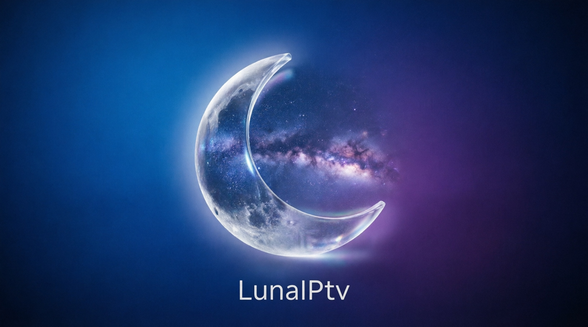

<p align="center">
  
</p>

<p align="center">
  <b>Your own IPTV player for Android TV</b><br>
  <sub>Fast · modern · remote-first — bring your own M3U or Xtream sources</sub>
</p>

<p align="center">
  
  
  
  
  
  
</p>

<p align="center">
  <a href="https://github.com/JoseAngelAz/LunaIPtv/actions/workflows/android.yml">
    
  </a>
</p>

---

# English

LunaIPtv is a native **Android TV** IPTV **player** built with Kotlin, Jetpack Compose for TV, and a
**dual playback engine** — **libmpv (FFmpeg)** for movies/series and maximum compatibility, **ExoPlayer
(Media3)** for near-instant Live TV. It's a *player only* — you bring your own Xtream login or M3U playlist
(by **URL or a local `.m3u`/`.m3u8` file** on the device), and LunaIPtv gives you a fast, modern, remote-first
way to browse and watch them.

> **Disclaimer:** LunaIPtv does **not** provide any channels, playlists, subscriptions, streams, or media content.
> You are responsible for adding your own legally accessible sources.

> **About this project:** LunaIPtv is a fork of [OwnTV](https://github.com/ahXN00/OwnTV), an open-source IPTV player originally created by [ahXN00](https://github.com/ahXN00). The original project was released under the **GNU General Public License v3 (GPLv3)**, which grants everyone the freedom to use, modify, and redistribute the software. This fork continues that mission: **LunaIPtv will always remain free, open source, and community-driven.** The goal is to provide a reliable, secure, and easy-to-use IPTV player for Android TV — because a player is merely a tool to access content you already pay for, and tools should not carry an additional cost.

---

## Credits

**Original project by:** [ahXN00](https://github.com/ahXN00/OwnTV)

**Fork & maintenance by:** **Jose Angel Azucena Mendez** — Maintaining and improving LunaIPtv to ensure a free, stable, and secure IPTV experience for Android TV.

This project is **open source** under the **GNU General Public License v3 (GPLv3)**. Anyone is free to:
- **Use** the software for any purpose
- **Copy** and distribute the software
- **Modify** and create derivative works
- **Sell** or gift the software (under the same license terms)

See the [LICENSE](LICENSE) file for the full GPLv3 text.

---

## Community

Questions, ideas, bug reports — or just want to follow along? **Join the LunaIPtv Telegram group:**

### [t.me/LunaIPtvSv](https://t.me/LunaIPtvSv)

Scan to join from your phone:

<a href="https://t.me/LunaIPtvSv"></a>

---

## Features

- **Dual playback engine** — libmpv (FFmpeg) for maximum compatibility, ExoPlayer (Media3) for near-instant Live TV
- **Live TV** — full-screen playback with channel list sidebar, EPG, catch-up, and time-shift
- **Movies & Series** — browse and play VOD content with metadata, trailers, and subtitle support
- **Profiles** — multiple user profiles with optional PIN protection
- **Backup & Restore** — full app state backup including settings, sources, and watch history
- **EPG (Electronic Program Guide)** — grid-based TV guide with programme details
- **Search** — full-text search across movies, series, and live channels
- **Watch Next** — Android TV homescreen integration for continuing playback
- **Multi-language** — English and Spanish with in-app language switching
- **Theme engine** — multiple color themes with custom accent color picker
- **UI Zoom** — adjustable UI scaling for accessibility
- **Catch-up & Time-shift** — rewind live TV and jump to past programmes
- **Subtitle support** — SRT, SSA/ASS, PGS, VOBSUB, and DVB bitmap subtitles
- **Audio track selection** — choose between multiple audio tracks per stream
- **Dynamic audio normalization** — consistent volume across IPTV channels via mpv `dynaudnorm`

---

## Performance Optimizations

The following optimizations have been implemented to improve speed, audio stability, and UI smoothness:

### Audio Stability
- **Android Audio Focus** — proper `requestAudioFocus`/`abandonAudioFocus` lifecycle prevents audio loss when other apps or the system interrupt
- **Engine-switch silence reduced** — mpv↔ExoPlayer transitions reduced from 600ms to 250ms dead silence
- **PiP dock guard** — mini-player docking no longer triggers `onStop()` audio kill from launcher overlays
- **Background-stop guard** — `suppressBackgroundStop` flag prevents audio death during transient lifecycle events

### Content Loading Speed
- **Parallel Home queries** — Home screen loads 4 phases of DB queries concurrently with `coroutineScope { async {} }` instead of sequentially (~3x faster cold start)
- **Coil disk cache** — 50 MB disk cache for posters/logos eliminates redundant network fetches on cold start (~2-3x faster grid rendering)
- **Memory cache at 15%** — increased from 10% for fewer evictions during fast scrolling
- **M3U batch inserts** — series seasons/episodes inserted in 3 batch calls instead of N×2 per show (6x faster for large playlists)
- **Deferred ANALYZE** — skipped on small syncs (<5k rows) to avoid 1s+ overhead on incremental updates

### UI Scroll Smoothness
- **Stable keys on all content lists** — Live channels, Movies (list+grid), Series (list+grid), and Episodes use `key = { ... id }` to prevent unnecessary recomposition on page loads
- **`contentType` on lazy lists** — helps Compose reuse layout nodes during scrolling
- **JSON parsing memoized** — `jsonList()`/`jsonStringList()` wrapped in `remember()` to avoid re-parsing on every recomposition
- **FocusableSurface optimization** — scale/shadow animations skipped when `focusedScale=1f` (list mode), halving animation objects per item
- **EPG cache bounded** — `LinkedHashMap` with max 200 entries prevents memory leak over long sessions
- **Count flow debounced** — `500ms debounce` prevents re-querying channel counts on every table invalidation during background syncs

---

## Technology Stack

| Layer | Technology |
|---|---|
| **Language** | Kotlin 2.3.10 |
| **UI** | Jetpack Compose for TV (tv-material3) |
| **Navigation** | Compose Navigation (navController) |
| **DI** | Koin (BOM-managed) |
| **Database** | Room + KSP |
| **Networking** | OkHttp |
| **Image loading** | Coil (Compose) |
| **Media playback** | libmpv (FFmpeg) + ExoPlayer (Media3) |
| **YouTube trailers** | YouTube IFrame Player (WebView) |
| **Preferences** | DataStore Preferences |
| **Background sync** | WorkManager |
| **Architecture** | MVVM with Repository pattern |
| **Target** | Android TV (API 26+) |

---

## Architecture

```
app/src/main/java/com/lunaiptv/
├── core/                    # Shared infrastructure
│   ├── data/                # Database (Room), DataStore
│   ├── sync/                # WorkManager sync workers
│   ├── tv/                  # Android TV homescreen (Watch Next)
│   ├── update/              # In-app update checker
│   └── util/                # Utilities (LocaleHelper, etc.)
├── features/                # Feature modules (screen + ViewModel)
│   ├── home/                # Home screen (On Now, Continue Watching)
│   ├── live/                # Live TV playback
│   ├── movies/              # Movies browse + player
│   ├── series/              # Series browse + player
│   ├── settings/            # Settings screens
│   ├── setup/               # Onboarding wizard
│   ├── profiles/            # Multi-profile support
│   └── shell/               # Main shell (sidebar, top bar)
├── player/                  # Playback engines (mpv + ExoPlayer)
├── ui/                      # Theme, colors, typography
└── MainActivity.kt          # Entry point
```

---

## Building

```bash
# Clone the repository
git clone https://github.com/JoseAngelAz/LunaIPtv.git
cd LunaIPtv

# Build debug APK
./gradlew assembleDebug

# Install on connected device/emulator
./gradlew installDebug
```

**Requirements:**
- Android Studio Ladybug or later
- JDK 17
- Android SDK 36
- Kotlin 2.3.10+

> **New to Android development?** See the [**Installation Guide (INSTALL.md)**](INSTALL.md) for step-by-step instructions with screenshots.

> **Need deployment help?** See the [**Deployment Guide (DEPLOY.md)**](DEPLOY.md) for CI/CD, keystore setup, and distribution options.

---

## License

This project is licensed under the **GNU General Public License v3.0** — see the [LICENSE](LICENSE) file for details.

```
Copyright (C) 2024 ahXN00
Copyright (C) 2025 Jose Angel Azucena Mendez (fork)

This program is free software: you can redistribute it and/or modify
it under the terms of the GNU General Public License as published by
the Free Software Foundation, either version 3 of the License, or
(at your option) any later version.

This program is distributed in the hope that it will be useful,
but WITHOUT ANY WARRANTY; without even the implied warranty of
MERCHANTABILITY or FITNESS FOR A PARTICULAR PURPOSE.  See the
GNU General Public License for more details.

You should have received a copy of the GNU General Public License
along with this program.  If not, see <https://www.gnu.org/licenses/>.
```

---

## Disclaimer

This software is provided "as is" without warranty of any kind. The developers are not responsible for:
- The legality of IPTV sources used with this player
- Any content accessed through third-party playlists
- Any damages arising from the use of this software

Users are solely responsible for ensuring they have the legal right to access any content played through LunaIPtv.

---
---

# Español

LunaIPtv es un **reproductor** nativo de IPTV para **Android TV** desarrollado con Kotlin, Jetpack Compose for TV y un **motor de reproduccion dual** — **libmpv (FFmpeg)** para peliculas/series y compatibilidad maxima, **ExoPlayer (Media3)** para TV en vivo con inicio casi instantaneo. Es *solo un reproductor* — tu aportas tu propio acceso Xtream o playlist M3U (por **URL o un archivo local `.m3u`/`.m3u8`** en el dispositivo), y LunaIPtv te ofrece una forma rapida, moderna y optimizada para control remoto de navegar y verlos.

> **Aviso:** LunaIPtv **no** proporciona canales, listas, suscripciones, flujos ni contenido multimedia.
> Tu eres responsable de agregar tus propias fuentes de acceso legal.

> **Sobre este proyecto:** LunaIPtv es un fork de [OwnTV](https://github.com/ahXN00/OwnTV), un reproductor IPTV de codigo abierto originalmente creado por [ahXN00](https://github.com/ahXN00). El proyecto original fue publicado bajo la **Licencia Publica General de GNU v3 (GPLv3)**, que concede a todos la libertad de usar, modificar y redistribuir el software. Este fork continua esa mision: **LunaIPtv siempre sera gratuito, de codigo abierto y impulsado por la comunidad.** El objetivo es ofrecer un reproductor IPTV confiable, seguro y facil de usar para Android TV — porque un reproductor es simplemente una herramienta para acceder a contenido que ya estas pagando, y las herramientas no deberian conllevar un costo adicional.

---

## Creditos

**Proyecto original por:** [ahXN00](https://github.com/ahXN00/OwnTV)

**Fork y mantenimiento por:** **Jose Angel Azucena Mendez** — Manteniendo y mejorando LunaIPtv para garantizar una experiencia IPTV gratuita, estable y segura para Android TV.

Este proyecto es **de codigo abierto** bajo la **Licencia Publica General de GNU v3 (GPLv3)**. Cualquiera es libre de:
- **Usar** el software para cualquier proposito
- **Copiar** y distribuir el software
- **Modificar** y crear obras derivadas
- **Vender** o regalar el software (bajo los mismos terminos de licencia)

Consulte el archivo [LICENSE](LICENSE) para el texto completo de la GPLv3.

---

## Comunidad

Preguntas, ideas, reportes de errores — o solo quieres estar al tanto? **Unete al grupo de Telegram de LunaIPtv:**

### [t.me/LunaIPtvSv](https://t.me/LunaIPtvSv)

Escanea para unirte desde tu telefono:

<a href="https://t.me/LunaIPtvSv"></a>

---

## Funcionalidades

- **Motor de reproduccion dual** — libmpv (FFmpeg) para compatibilidad maxima, ExoPlayer (Media3) para TV en vivo con inicio casi instantaneo
- **TV en vivo** — reproduccion a pantalla completa con barra lateral de canales, EPG, catch-up y time-shift
- **Peliculas y Series** — navega y reproduce contenido VOD con metadatos, trailers y soporte de subtitulos
- **Perfiles** — multiples perfiles de usuario con proteccion PIN opcional
- **Copia de seguridad y restauracion** — respaldo completo del estado de la app incluyendo ajustes, fuentes e historial de reproduccion
- **EPG (Guia Electronica de Programacion)** — guia de TV en cuadricula con detalles de programas
- **Busqueda** — busqueda de texto completo en peliculas, series y canales en vivo
- **Siguiente** — integracion con la pantalla de inicio de Android TV para continuar reproduccion
- **Multi-idioma** — ingles y espanol con cambio de idioma dentro de la app
- **Motor de temas** — multiples temas de color con selector de color de acento personalizado
- **Zoom de UI** — escalado ajustable de la interfaz para accesibilidad
- **Catch-up y Time-shift** — rebobina la TV en vivo y salta a programas anteriores
- **Soporte de subtitulos** — SRT, SSA/ASS, PGS, VOBSUB y subtitulos DVB bitmap
- **Seleccion de pista de audio** — elige entre multiples pistas de audio por flujo
- **Normalizacion dinamica de audio** — volumen consistente en canales IPTV via mpv `dynaudnorm`

---

## Optimizaciones de Rendimiento

Se han implementado las siguientes optimizaciones para mejorar la velocidad, la estabilidad del audio y la suavidad de la interfaz:

### Estabilidad del Audio
- **Enfoque de Audio de Android** — el ciclo de vida adecuado de `requestAudioFocus`/`abandonAudioFocus` previene la perdida de audio cuando otras aplicaciones o el sistema interrumpen
- **Silencio entre motores reducido** — transiciones mpv↔ExoPlayer reducidas de 600ms a 250ms de silencio
- **Guardia de anclaje PiP** — el anclaje del mini-reproductor ya no activa la eliminacion de audio `onStop()` por superposiciones del lanzador
- **Guardia de detencion en segundo plano** — la bandera `suppressBackgroundStop` previene la muerte del audio durante eventos transitorios del ciclo de vida

### Velocidad de Carga de Contenido
- **Consultas paralelas en Inicio** — la pantalla de inicio carga 4 fases de consultas a la BD concurrentemente con `coroutineScope { async {} }` en lugar de secuencialmente (~3x mas rapido en inicio en frio)
- **Cache en disco Coil** — cache de 50 MB en disco para posters/logos elimina obtenciones de red redundantes (~2-3x mas rapido en renderizado de cuadricula)
- **Cache de memoria al 15%** — aumentado del 10% para menos eliminaciones durante desplazamiento rapido
- **Inserciones por lotes M3U** — temporadas/episodios de series insertados en 3 llamadas por lotes en lugar de N×2 por serie (6x mas rapido para listas grandes)
- **ANALYZE diferido** — omitido en sincronizaciones pequenas (<5k filas) para evitar sobrecarga de 1s+ en actualizaciones incrementales

### Suavidad de Desplazamiento de UI
- **Claves estables en todas las listas** — canales en vivo, peliculas (lista+cuadricula), series (lista+cuadricula) y episodios usan `key = { ... id }` para prevenir recomposicion innecesaria en cargas de pagina
- **`contentType` en listas perezosas** — ayuda a Compose a reutilizar nodos de diseno durante el desplazamiento
- **Analisis JSON memorizado** — `jsonList()`/`jsonStringList()` envueltos en `remember()` para evitar re-analisis en cada recomposicion
- **Optimizacion de FocusableSurface** — animaciones de escala/sombra omitidas cuando `focusedScale=1f` (modo lista), reduciendo a la mitad los objetos de animacion por item
- **Cache EPG acotado** — `LinkedHashMap` con maximo 200 entradas previene fugas de memoria en sesiones largas
- **Flujo de conteo con debounce** — `500ms debounce` previere re-consulta de conteos de canales en cada invalidacion de tabla durante sincronizaciones en segundo plano

---

## Stack Tecnologico

| Capa | Tecnologia |
|---|---|
| **Lenguaje** | Kotlin 2.3.10 |
| **UI** | Jetpack Compose for TV (tv-material3) |
| **Navegacion** | Compose Navigation (navController) |
| **DI** | Koin (gestionado por BOM) |
| **Base de datos** | Room + KSP |
| **Red** | OkHttp |
| **Carga de imagenes** | Coil (Compose) |
| **Reproduccion multimedia** | libmpv (FFmpeg) + ExoPlayer (Media3) |
| **Trailers de YouTube** | YouTube IFrame Player (WebView) |
| **Preferencias** | DataStore Preferences |
| **Sincronizacion en segundo plano** | WorkManager |
| **Arquitectura** | MVVM con patron Repository |
| **Objetivo** | Android TV (API 26+) |

---

## Arquitectura

```
app/src/main/java/com/lunaiptv/
├── core/                    # Infraestructura compartida
│   ├── data/                # Base de datos (Room), DataStore
│   ├── sync/                # Workers de sincronizacion WorkManager
│   ├── tv/                  # Pantalla de inicio Android TV (Watch Next)
│   ├── update/              # Verificador de actualizaciones in-app
│   └── util/                # Utilidades (LocaleHelper, etc.)
├── features/                # Modulos de funcionalidad (pantalla + ViewModel)
│   ├── home/                # Pantalla de inicio (Ahora, Continuar viendo)
│   ├── live/                # Reproduccion de TV en vivo
│   ├── movies/              # Navegador de peliculas + reproductor
│   ├── series/              # Navegador de series + reproductor
│   ├── settings/            # Pantallas de ajustes
│   ├── setup/               # Asistente de configuracion inicial
│   ├── profiles/            # Soporte multi-perfil
│   └── shell/               # Shell principal (barra lateral, barra superior)
├── player/                  # Motores de reproduccion (mpv + ExoPlayer)
├── ui/                      # Tema, colores, tipografia
└── MainActivity.kt          # Punto de entrada
```

---

## Compilacion

```bash
# Clonar el repositorio
git clone https://github.com/JoseAngelAz/LunaIPtv.git
cd LunaIPtv

# Compilar APK de depuracion
./gradlew assembleDebug

# Instalar en dispositivo/emulador conectado
./gradlew installDebug
```

**Requisitos:**
- Android Studio Ladybug o posterior
- JDK 17
- Android SDK 36
- Kotlin 2.3.10+

> **Nuevo en el desarrollo de Android?** Consulta la [**Guia de Instalacion (INSTALL.md)**](INSTALL.md) para instrucciones paso a paso con capturas de pantalla.

> **Necesitas ayuda con el despliegue?** Consulta la [**Guia de Despliegue (DEPLOY.md)**](DEPLOY.md) para CI/CD, configuracion de keystore y opciones de distribucion.

---

## Licencia

Este proyecto esta licenciado bajo la **Licencia Publica General de GNU v3.0** — consulta el archivo [LICENSE](LICENSE) para mas detalles.

```
Copyright (C) 2024 ahXN00
Copyright (C) 2025 Jose Angel Azucena Mendez (fork)

Este programa es software libre: puede redistribuirlo y/o modificarlo
bajo los terminos de la Licencia Publica General de GNU publicada por
la Free Software Foundation, ya sea la version 3 de la Licencia, o
(en su opcion) cualquier version posterior.

Este programa se distribuye con la esperanza de que sea util,
pero SIN NINGUNA GARANTIA; incluso sin la garantia implicita de
COMERCIABILIDAD o IDONEIDAD PARA UN PROPOSITO PARTICULAR. Consulte la
Licencia Publica General de GNU para mas detalles.

Deberia haber recibido una copia de la Licencia Publica General de GNU
junto con este programa. Si no, consulte <https://www.gnu.org/licenses/>.
```

---

## Aviso Legal

Este software se proporciona "tal cual" sin garantia de ningun tipo. Los desarrolladores no son responsables de:
- La legalidad de las fuentes IPTV utilizadas con este reproductor
- Cualquier contenido accedido a traves de listas de terceros
- Cualquier dano derivado del uso de este software

Los usuarios son los unicos responsables de asegurar que tienen el derecho legal de acceder a cualquier contenido reproducido a traves de LunaIPtv.
